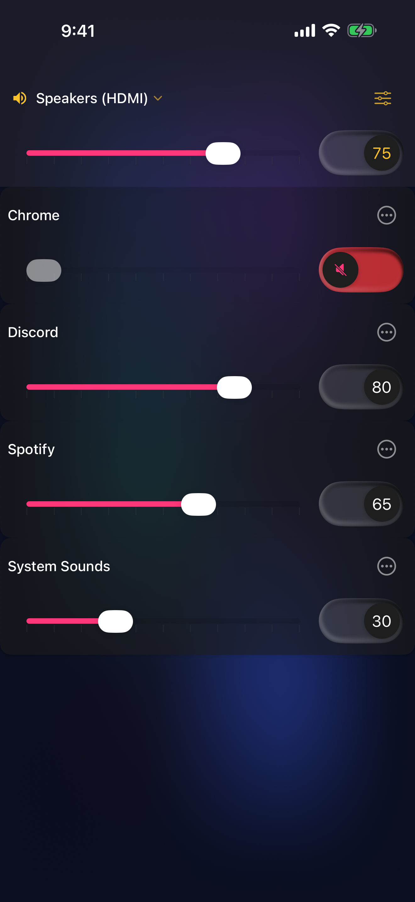
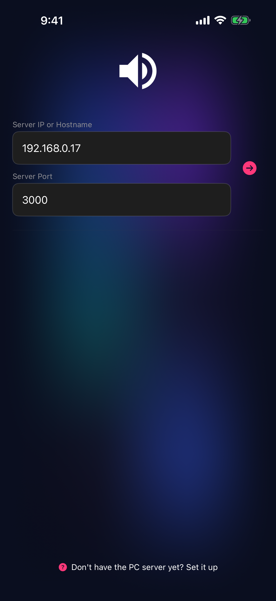
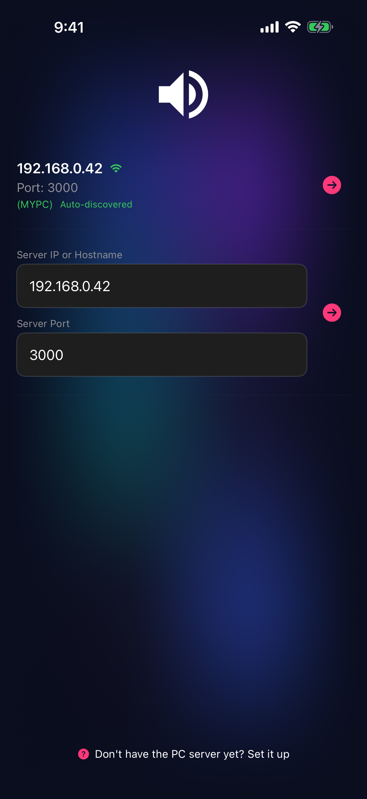
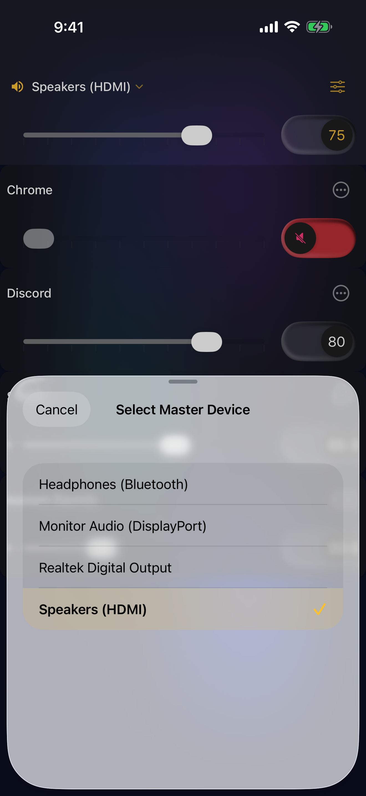

# PC Volume Control — iOS

Control your Windows PC's application audio volumes remotely from your iPhone or iPad.

## What it does

PC Volume Control lets you adjust the volume of individual applications running on your Windows PC from your iOS device. This was designed primarily for remote volume control while gaming or streaming.

The app connects to a free companion Windows server over your local network, displaying all running applications and their volume levels in a clean, responsive interface. Adjust volumes, mute/unmute, and switch between output devices (speakers, headphones, etc.) all from your phone or tablet.

**Features:**
- Remote application volume control
- Per-app mute/unmute
- Master volume and mute for the default output device
- Auto-discovery of the server on your local network (or manual IP/port entry)

## Demo

[Watch a quick demo](https://www.youtube.com/shorts/yMf1cxd65t4)

## Screenshots

**Connection Screen** — Discover your PC server automatically over mDNS, or enter its IP and port manually.

**Auto-Discovery** — PC servers broadcasting on your network appear automatically with the Wi-Fi badge.

**Device Selector** — Switch between multiple audio output devices (speakers, headphones, etc.).

## Getting Started

### 1. Download the App

[Get it on the App Store](https://itunes.apple.com/us/app/pcvolumecontrol/id1336171942?ls=1&mt=8)

### 2. Install the Windows Server

PC Volume Control requires the free companion server on your Windows PC.

1. **Download** the latest [PC Volume Control Server release](https://github.com/PcVolumeControl/PcVolumeControlWindows/releases/latest) for Windows.
2. **Install and run** the server on your PC. Allow it through Windows Firewall when prompted (private networks).
3. **Note the server address** — the server window displays your PC's IP address and port (default 3000).

### 3. Connect Your Device

1. **Open PC Volume Control** on your iOS device.
2. **Same Wi-Fi?** If your iPhone/iPad and PC are on the same Wi-Fi network, the server will appear automatically with a green Wi-Fi badge — just tap to connect.
3. **Manual IP entry?** If auto-discovery doesn't find it, enter your PC's IP address and port (e.g., `192.168.1.100`) in the "Server IP or Hostname" field and tap the arrow to connect.

### Troubleshooting

- **Can't connect?** Check Windows Firewall isn't blocking the server.
- **No audio output?** Use the master device selector (top of the volume screen) to switch between multiple audio outputs.

## Contributing

Head over to [our wiki](https://github.com/PcVolumeControl/PcVolumeControliOS/wiki) for detailed instructions on installing from source, contributing, and more.

## License

See LICENSE file for details.
